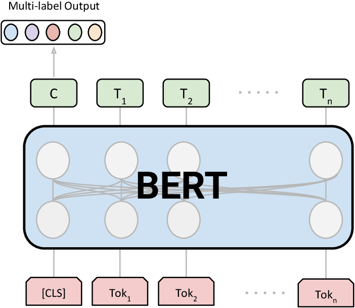

# About Project
In this project we mainly calculated the similarity between two paragraphs. We gave two paragraphs  as input  in html format , generated a list of 5 keywords for individual paragraphs , then counted the number of similar keywords and percentage of similarities .

# Working of Project
We used a pre-trained BRET model for training our data/paragraphs. And we had to import some packages , tokenize , select stop word. Then we built a function:

    def func(d1,d2):
        count1 = CountVectorizer(ngram_range=n_gram_range, stop_words=stop_words).fit([d1])
        count2 = CountVectorizer(ngram_range=n_gram_range, stop_words=stop_words).fit([d2])
        candidates1 = count1.get_feature_names()
        candidates2 = count2.get_feature_names()
        doc_embedding1 = model.encode([d1])
        doc_embedding2 = model.encode([d2])
        candidate_embeddings1 = model.encode(candidates1)
        candidate_embeddings2 = model.encode(candidates2)
        distances1 = cosine_similarity(doc_embedding1, candidate_embeddings1)
        distances2 = cosine_similarity(doc_embedding2, candidate_embeddings2)
        keywords1 = [candidates1[index] for index in distances1.argsort()[0][-top_n:]] words
        keywords2 = [candidates2[index] for index in distances2.argsort()[0][-top_n:]]
        sc=0
        for i in keywords1:
            for j in keywords2:
                if i==j:
                    sc+=1
        return(sc)

    
We removed our stop  words, extracted features , encoded them then tried to measure similarities using cosine_similaritis method.

We would get the output like in the image shown above.
# How to RUN the project
1.	Install the python packages as mentioned in the 'dependencies.txt' file.
2.	Now run the 'Project2-ParagraphSimilaritcheck.py' file.
3.	Input two paragraphs which are needed to be compared and click on 'Upload' button.
4.	Score will be generated, based on number of keywords which are same for both paragraphs, based on list of top 5 keywords of each paragraph
